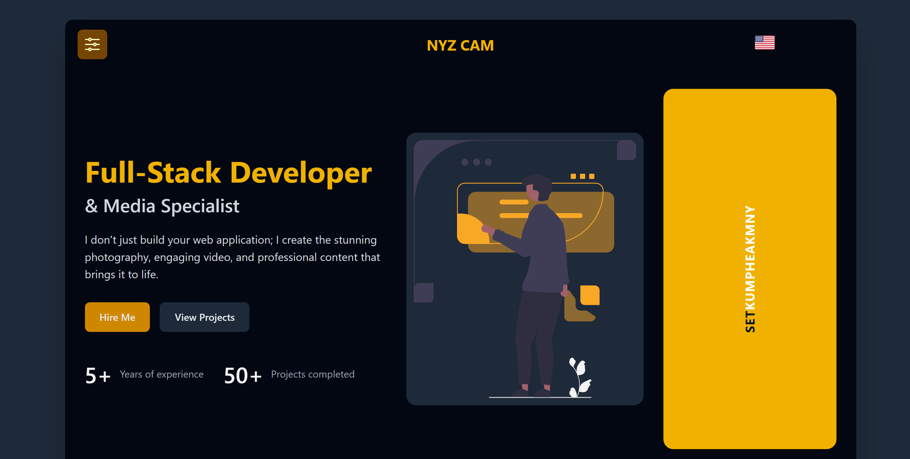

# Personal Portfolio Website

This is my personal portfolio website, built to showcase my skills, projects, and professional experience. The site is developed with a modern tech stack, featuring Vue 3 for the frontend framework and Vite as the build tool for a fast and efficient development experience. It is styled with Tailwind CSS for a clean, responsive, and utility-first design.

## ✨ Live Demo

**[View Live Site](https://nyzcam.vercel.app/)**

## 📸 Screenshot



## 🚀 Features

-   **Modern & Responsive Design**: Fully responsive layout that looks great on all devices, from mobile phones to desktops.
-   **Fast & Performant**: Built with Vue 3 and Vite for lightning-fast performance and an optimized user experience.
-   **Interactive UI**: Smooth animations and transitions using the **AOS (Animate On Scroll)** library.
-   **Project Showcase**: A sleek project section featuring a **Swiper.js** carousel to display my work.
-   **Clean Codebase**: Written with modern JavaScript (ESM) and organized into reusable Vue components.

## 🛠️ Tech Stack

-   **Framework**: [Vue 3](https://vuejs.org/)
-   **Build Tool**: [Vite](https://vitejs.dev/)
-   **Styling**: [Tailwind CSS 4](https://tailwindcss.com/)
-   **Icons**: [Heroicons](https://heroicons.com/)
-   **Animations**: [AOS (Animate On Scroll)](https://michalsnik.github.io/aos/)
-   **Carousel/Slider**: [Swiper.js](https://swiperjs.com/)

## 📦 Getting Started

Follow these instructions to get a copy of the project up and running on your local machine for development and testing purposes.

### Prerequisites

You need to have [Node.js](https://nodejs.org/) (version 18 or higher is recommended) and [npm](https://www.npmjs.com/) installed on your computer.

### Installation

1.  **Clone the repository:**
    ```bash
    git clone https://github.com/kompheakmony/porfilio-vue.git
    ```
2.  **Navigate to the project directory:**
    ```bash
    cd my-profile
    ```
3.  **Install the dependencies:**
    ```bash
    npm install
    ```

## 📜 Available Scripts

In the project directory, you can run the following commands:

### `npm run dev`

Runs the app in development mode. Open [http://localhost:5173](http://localhost:5173) (the port may vary) to view it in the browser. The page will hot-reload if you make edits.

### `npm run build`

Builds the app for production to the `dist` folder. It correctly bundles Vue in production mode and optimizes the build for the best performance.

### `npm run preview`

This command serves the production build from the `dist` folder locally. It's a great way to check if the production build works correctly before deploying.

## 🚀 Deployment

The `npm run build` command creates a `dist` directory with all the static files needed for deployment. You can deploy this `dist` folder to any static site hosting service, such as:

-   [Netlify](https://www.netlify.com/)
-   [Vercel](https://vercel.com/)
-   [GitHub Pages](https://pages.github.com/)

## 📄 License

This project is licensed under the MIT License. See the [LICENSE](LICENSE) file for details.
